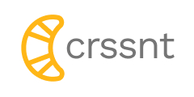

<p align="center">
  <a href="https://crssnt.com/">
    
  </a>
</p>

Crssnt is an open-source RSS feed generator for Google Sheets. With crssnt, you can create your own <b>c</b>ustom <b>RSS</b> feed from any data source which can get displayed in a (public) Google Sheet:
- existing RSS feeds
- websites and APIs
- data from manual input
- data from Sheets add-ons
- etc.

The easiest way to generate an RSS feed with crssnt is to add `https://crssnt.com/preview/` to the the beginning of your public Google Sheet URL, like this:


```
https://crssnt.com/preview/https://docs.google.com/spreadsheets/d/1wgHZMH8-kQsC0z38mnrfGpR1cgQE7yu2kUQB9On9iJw
```
There is more details in this [blog post](https://www.notion.so/tgel0/Start-here-crssnt-101-how-to-get-started-043e0a6913a84fea8165e4fe83659258).

---
## Data Privacy

No personal data is being stored while using the crssnt feed generator. Some general usage data such as date and time of the request as well as the underlying Google Sheet ID are stored for analytics purposes. You can disable the Sheet ID logging by adding `&logging=false` to the end of the crssnt feed URL.

Read more [here](https://crssnt.com/legal).

## For Devs

### Installing, Contributing

As explained above, you can use crssnt without any installation by using my free hosted version via `https://crssnt.com/preview/`. If you want to install it on your own server for exploration or contribution purposes continue reading below.

Crssnt is built with [Cloud Functions for Firebase](https://firebase.google.com/docs/functions). Check out the official [Getting Started Guide](https://firebase.google.com/docs/functions/get-started) to learn more about Firebase Functions.

Once you have installed the Firebase CLI and cloned this repository, you can emulate the function locally by running `firebase emulators:start` and going to `http://localhost:4000/`.

### License

Licensed under the The MIT License. Copyright 2022 Tomislav Gelo.
